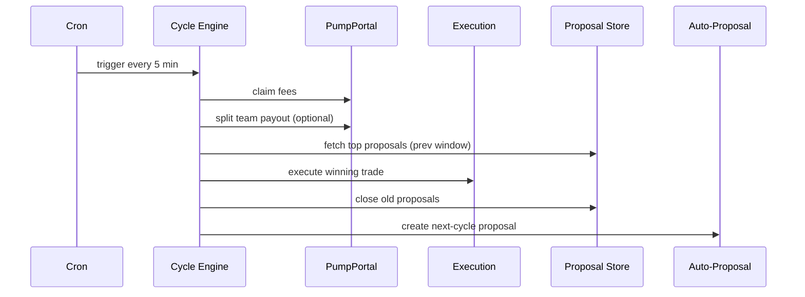

# The 5-Minute Cycle

The system runs in discrete 5-minute windows. Each run acts on the **previous window** to keep voting stable.

---

## Sequence

1. Claim fees
2. Split a team payout (optional)
3. Execute the top proposal from the prior window
4. Close proposals from that window
5. Create an auto-proposal for the next window

---

## Timeline

---

## Why Previous Window?

=== "Stability"
    Votes stop moving once a window closes. Executing the previous window
    makes the outcome deterministic and auditable.

=== "Observability"
    Every run writes a `cycle_runs` record with start and finish timestamps.

=== "Safety"
    You can block re-entry by cycle ID to avoid double execution.

---

## Configuration (Key Env)

- `PUMPPORTAL_API_KEY`
- `PUMPFUN_MINT` (optional for auto-buy)
- `FEE_SPLIT_ENABLED` + `FEE_SPLIT_PAYOUT_WALLET`
- `CFUND_SYSTEM_AGENT_WALLET` + `CFUND_SYSTEM_AGENT_ID`
- `CFUND_TOKEN_ADDRESS`

