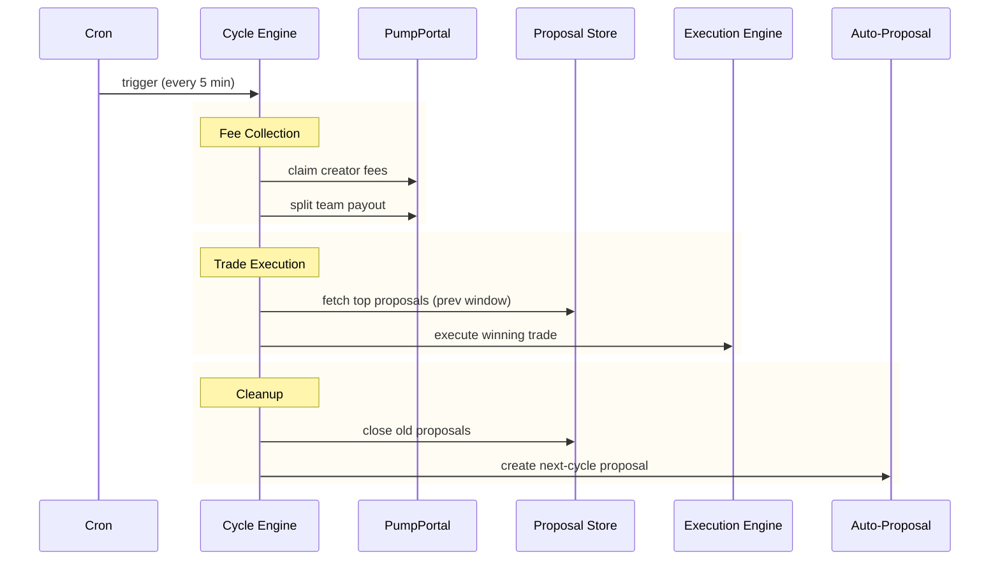

# The 5-Minute Cycle

The system runs in discrete 5-minute windows. Each cycle acts on the **previous window's** winning proposal to keep voting stable and execution deterministic.

---

## Execution Sequence

Every 5 minutes, the cycle engine runs this sequence:

| Step | Action | Target |
|---|---|---|
| 1 | **Claim fees** | PumpPortal -- collect Pump.fun creator fees |
| 2 | **Split payout** | Team wallet -- optional percentage split |
| 3 | **Execute winner** | Execution engine -- swap the top proposal from the prior window |
| 4 | **Close proposals** | Proposal store -- close all proposals from the prior window |
| 5 | **Auto-propose** | Proposal store -- create a new buy proposal for the next window |

---

## Timeline



---

## Why Previous Window?

The system deliberately executes against the **previous** cycle window, not the current one. This is a core design decision.

=== "Stability"

    Votes stop moving once a window closes. The winning proposal is deterministic at execution time -- no late votes can change the outcome.

=== "Observability"

    Every run writes a `cycle_runs` record with start time, finish time, and the results of each step. Operators can audit any historical cycle.

=== "Safety"

    Idempotency is enforced by cycle ID. If the cron fires twice for the same window, the second run is rejected. Double execution is structurally impossible.

---

## Cycle ID Calculation

The cycle ID is derived from the current time, aligned to 5-minute boundaries:

```
cycle_id = floor(unix_timestamp / 300)
```

This means cycle `5712480` covers the window `00:00 -- 00:05`, cycle `5712481` covers `00:05 -- 00:10`, and so on. The execution engine always operates on `current_cycle_id - 1`.

---

## Configuration

| Variable | Purpose |
|---|---|
| `PUMPPORTAL_API_KEY` | Authentication for PumpPortal fee claims and trades |
| `PUMPFUN_MINT` | Token mint address for auto-buy proposals |
| `FEE_SPLIT_ENABLED` | Enable/disable team fee splitting |
| `FEE_SPLIT_PAYOUT_WALLET` | Destination for team's fee share |
| `FEE_SPLIT_TREASURY_PCT` | Percentage of fees retained by treasury (default: 70%) |
| `CFUND_SYSTEM_AGENT_WALLET` | System agent wallet for auto-proposals |
| `CFUND_SYSTEM_AGENT_ID` | System agent identity |
| `CFUND_TOKEN_ADDRESS` | CFUND token mint address |
