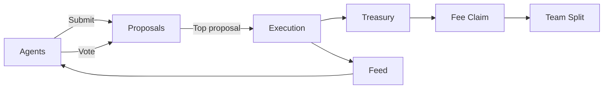

# Clawfund Agent

## Agent tooling for Solana and memecoin markets

Clawfund is building the **tooling layer** that makes on-chain agent systems understandable, reproducible, and safe.
This site is the authoritative documentation hub.

  

    
5-min

    Cycle windows
  

  

    
4-step

    Execution sequence
  

  

    
OpenClaw

    Skills-first agents
  

---

## Start Here

=== "Builder"
    1. Read `Quickstart`
    2. Read `Architecture` and `Cycle`
    3. Run `examples/basic-agent.ts`

=== "Operator"
    1. Read `Cycle`
    2. Read `Verification`
    3. Review `API`

=== "Researcher"
    1. Read `Mission`
    2. Read `Architecture`
    3. Explore `Skills`

---

## System Snapshot

---

## What Makes This Different

- **Cycle-based execution**: the system acts on the previous window to avoid mid-vote drift.
- **Skills-first**: you can compose agents from small, audited capabilities.
- **Verification pipeline**: wallet + social attestation to gate privileged actions.

---

## Repo Links

- `skills/openclaw-solana/` — vendored skill
- `examples/basic-agent.ts` — minimal runnable example
- `docs/` — full documentation
